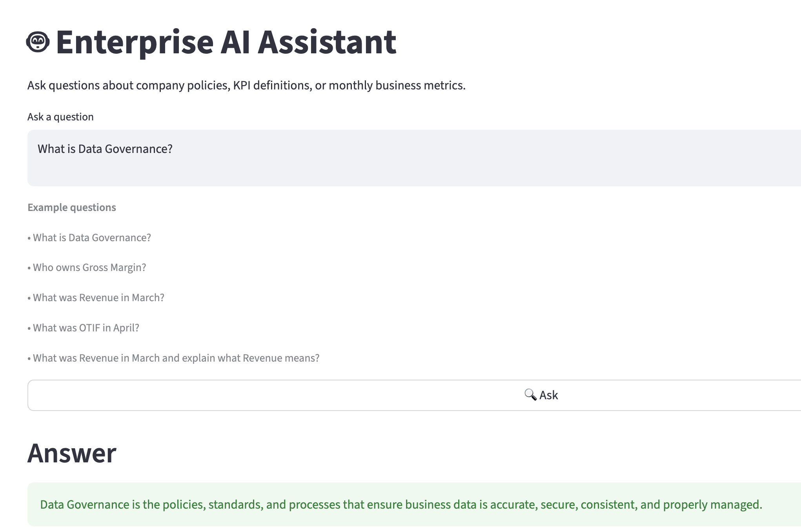
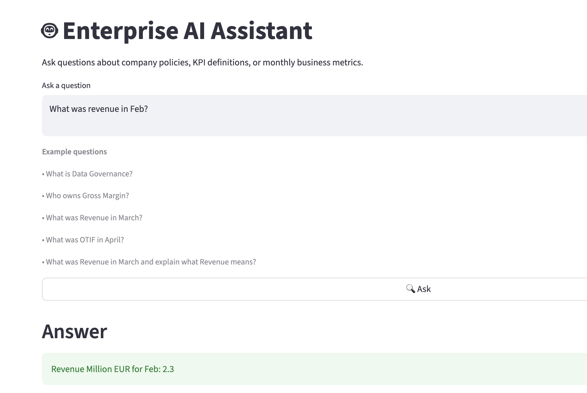
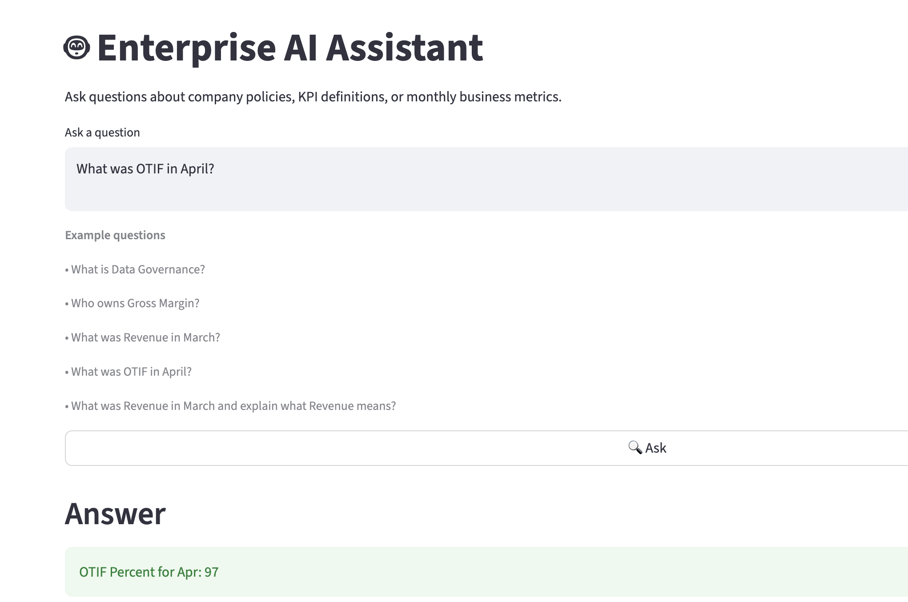
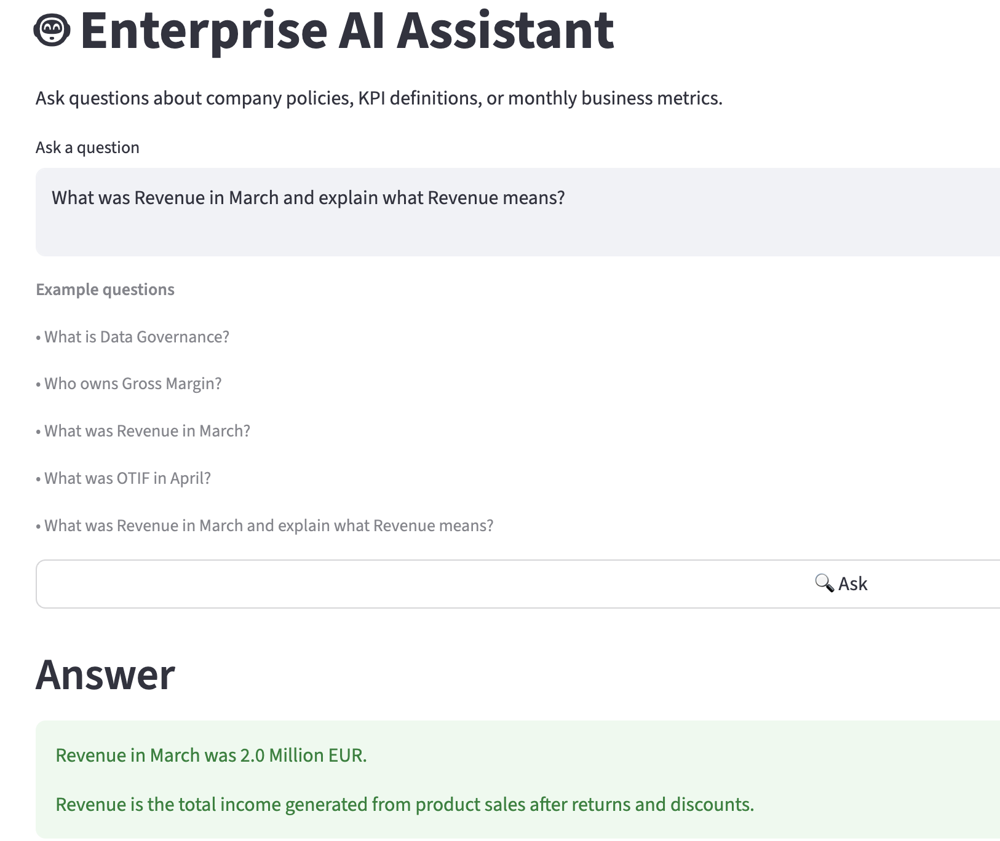

# 🤖 Enterprise AI Assistant

An enterprise AI assistant built using **LangChain**, **Google Gemini**, **ChromaDB**, and **Streamlit** that answers business questions using both enterprise documents and structured KPI datasets.

The application automatically classifies user questions into one of three intelligent routes:

- 📄 **RAG** – Answers questions using enterprise PDF documents.
- 📊 **CSV Analytics** – Retrieves monthly KPI values from structured datasets.
- 🔀 **Hybrid** – Combines structured KPI data with enterprise document knowledge.

---

# Features

- 📄 Multi-document Retrieval-Augmented Generation (RAG)
- 📊 Business KPI lookup from CSV datasets
- 🔀 Hybrid document + structured data reasoning
- 🧠 Intelligent query routing
- 🔍 Semantic search using ChromaDB
- 🤖 Google Gemini 2.5 Flash Lite
- 💻 Interactive Streamlit web interface

---

# System Architecture

```
                    User Question
                          │
                          ▼
                 Query Classification
            ┌──────────┬──────────┬──────────┐
            │          │          │
            ▼          ▼          ▼
         RAG        CSV Query    Hybrid
            │          │          │
            ▼          ▼          ▼
      ChromaDB     KPI CSVs   Both Sources
            │          │          │
            └──────────┴──────────┘
                     ▼
              Gemini 2.5 Flash Lite
                     ▼
                Final Response
```

---

# Project Structure

```
Enterprise-AI-Assistant/
│
├── app.py
├── 1.0_RAG_PDF.ipynb
├── README.md
├── pyproject.toml
├── uv.lock
├── .gitignore
│
├── docs/
├── data/
├── result_screenshots/
│   ├── rag-query.png
│   ├── csv-revenue-query.png
│   ├── csv-otif-query.png
│   └── hybrid-query.png
│
└── Vectorstore/
```

---

# Tech Stack

- Python
- Streamlit
- LangChain
- Google Gemini 2.5 Flash Lite
- Google Gemini Embeddings (`models/gemini-embedding-001`)
- ChromaDB
- Pandas
- PyPDFLoader

---

# Demo

## 📄 RAG Query

**Question**

> What is Data Governance?



---

## 📊 CSV Query – Revenue

**Question**

> What was Revenue in February?



---

## 📊 CSV Query – OTIF

**Question**

> What was OTIF in April?



---

## 🔀 Hybrid Query

**Question**

> What was Revenue in March and explain what Revenue means?



---

# Running the Project

## Clone the repository

```bash
git clone https://github.com/<your-username>/enterprise-ai-assistant.git
cd enterprise-ai-assistant
```

## Create a `.env` file

```text
GOOGLE_API_KEY=your_google_api_key
```

## Install dependencies

Using uv:

```bash
uv sync
```

or

```bash
pip install -r requirements.txt
```

## Run the application

```bash
streamlit run app.py
```

---

# Example Questions

### 📄 RAG

- What is Data Governance?
- Who owns Gross Margin?
- Explain Forecast Accuracy.

### 📊 CSV

- What was Revenue in February?
- What was OTIF in April?
- What was OEE in June?

### 🔀 Hybrid

- What was Revenue in March and explain what Revenue means?
- What was OTIF in April and explain how it is calculated?

---

# Current Capabilities

- ✅ Multi-document PDF ingestion
- ✅ Semantic document retrieval
- ✅ Google Gemini embeddings
- ✅ Chroma vector database
- ✅ KPI retrieval from structured CSV files
- ✅ Intelligent query routing
- ✅ Hybrid document and KPI responses
- ✅ Streamlit web interface

---

# Future Improvements

- Conversation memory
- Natural language SQL support
- Additional enterprise data sources
- Response source citations
- Docker deployment

---

# Purpose

This project demonstrates how Retrieval-Augmented Generation (RAG) can be combined with structured business analytics to build an enterprise AI assistant capable of answering both document-based and KPI-related business questions through a single conversational interface.